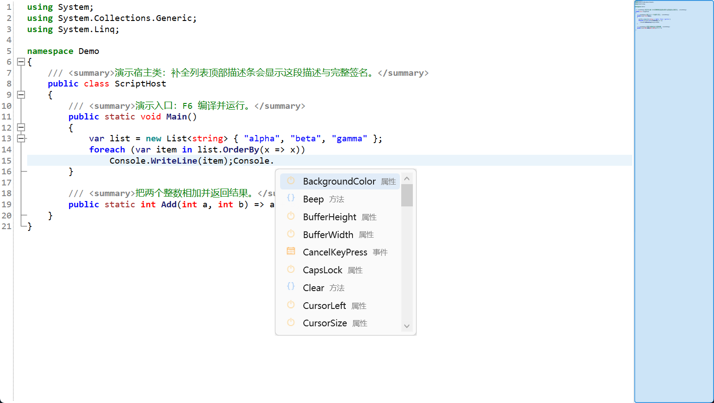
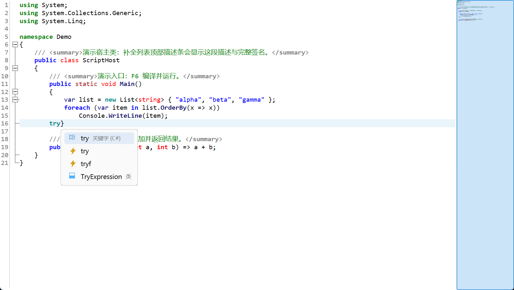
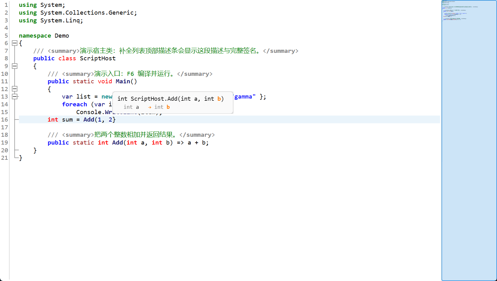
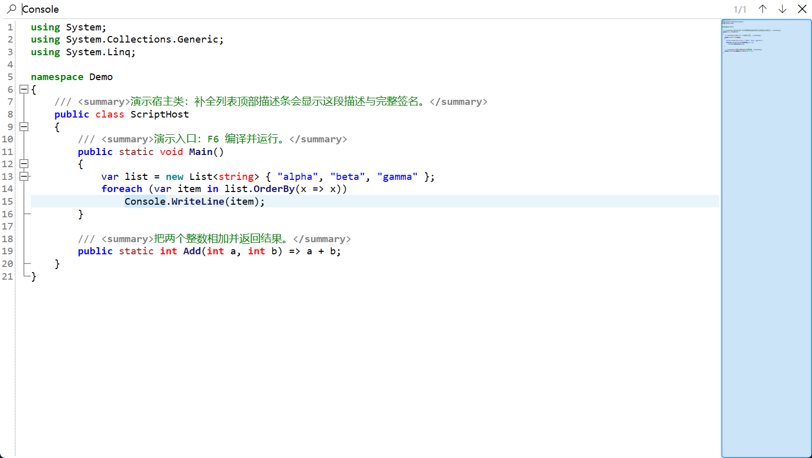
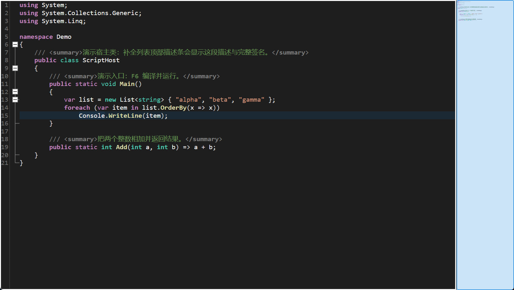
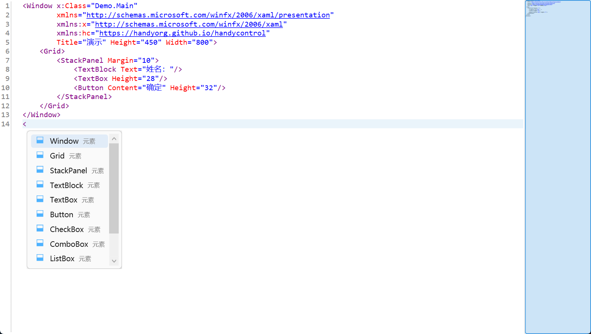
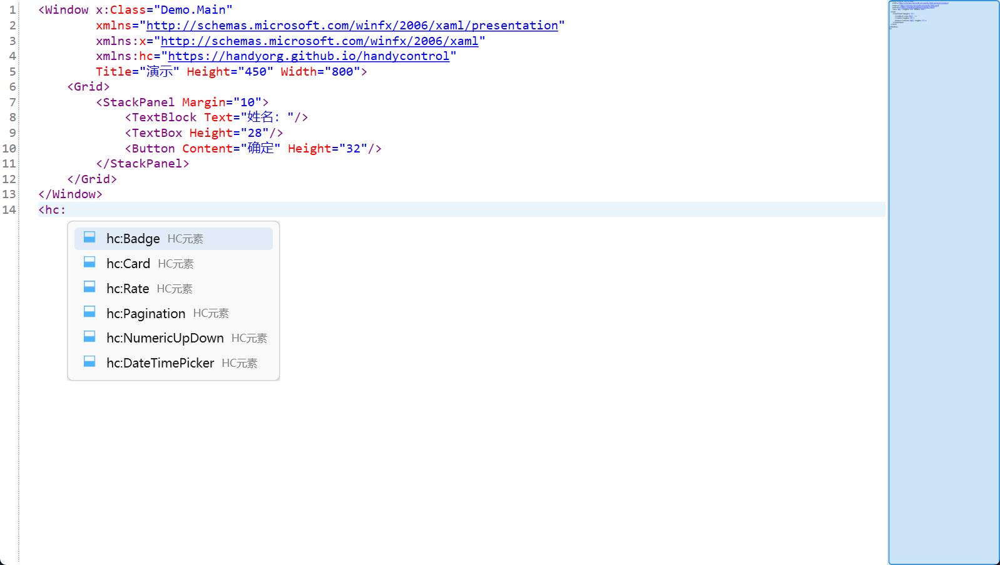

# CodeForgeDemo —— CodeForge 编辑器控件官方演示

[CodeForge](https://www.nuget.org/packages/CodeForge) 是面向 WPF 的 C# / XAML 代码编辑器控件：Roslyn 智能补全、编译诊断波浪线、签名帮助、代码片段、搜索、亮暗主题、即时编译与脚本运行。

本仓库是它的**演示工程**，也是控件 NuGet 包页面截图的出处。

## 演示内容

- **C# 智能补全**：Roslyn 驱动，描述条 + 签名小字 + 特性图标
  
- **代码片段**：⚡ for / foreach / try / tryf …，Tab 展开
  
- **签名帮助**：重载导航、当前参数高亮；采纳重载只插参数名
  
- **搜索条**：Ctrl+F，增量高亮 + 命中计数 + 回绕
  
- **暗色主题**
  
- **XAML 补全**（`ExternalCompletionProvider` 扩展点演示）：元素 / 属性 / 取值三级提示
  
- **HandyControl 前缀组**（声明了 `xmlns:hc` 才提示）
  

## 运行

要求 .NET Framework 4.8 + Visual Studio 2022+。

```bash
git clone https://github.com/1wangshuo/CodeForgeDemo.git
```

打开 `CodeForgeDemo.csproj`，F5。

## 关于 CodeForge 控件

NuGet：`Install-Package CodeForge`（单文件分发，依赖全部嵌入 DLL）。
工程地址：<https://github.com/1wangshuo/CodeForgeDemo> · 作者 WangShuo · MIT
